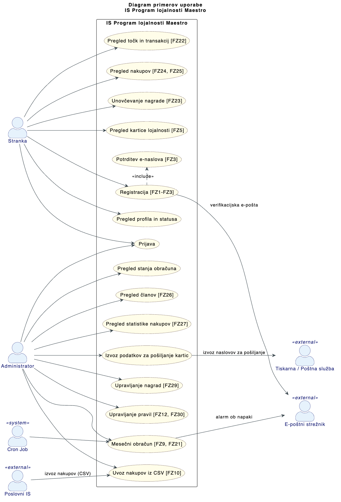

# Specifikacija zahtev

## 1. Uvod

Maestro je slovenska trgovska veriga, ki želi povečati ponovne nakupe in dolgoročno zvestobo strank. V ta namen vzpostavlja informacijski sistem za program lojalnosti, ki strankam omogoča zbiranje točk na podlagi mesečnih nakupov ter napredovanje med štirimi statusi lojalnosti: osnovni, bronasti, srebrni in zlati.

Sistem je sestavljen iz dveh delov: **članskega portala**, prek katerega se stranke registrirajo, pregledujejo točke in unovčujejo nagrade, ter **administratorskega portala**, ki zaposlenim omogoča upravljanje pravil, nagrad in statistik. Mesečni obračun točk in prehodov med statusi se izvaja samodejno na podlagi podatkov o nakupih iz obstoječega poslovnega informacijskega sistema trgovske verige.

Dokument opisuje funkcionalne zahteve sistema s pomočjo diagrama in opisov primerov uporabe ter podaja dodatne specifikacije glede zmogljivosti, varnosti in razširljivosti.

## 2. Diagram primerov uporabe

### 2.1 Diagram primerov uporabe

### 2.2 Opis primerov uporabe

#### 2.2.1 Registracija uporabnika

**Osnovni tok:**

1. Stranka odpre registracijsko stran portala.
2. Stranka vnese osebne podatke: ime, priimek, e-naslov, geslo in naslov bivališča.
3. Sistem preveri, da vsi obvezni podatki so prisotni in da e-naslov še ni registriran.
4. Sistem shrani strankin zapis z zastavico `email_verificiran = false`.
5. Sistem prek e-poštnega strežnika pošlje verifikacijsko sporočilo z enkratnim žetonom na vneseni e-naslov.
6. Stranka odpre sporočilo in klikne na verifikacijsko povezavo.
7. Sistem preveri veljavnost žetona in nastavi `email_verificiran = true`.
8. Sistem ustvari kartico lojalnosti (status pošiljanja: _v pripravi_) in dodeli začetni status lojalnosti »osnovni«.
9. Sistem preusmeri stranko na stran uspešne registracije.

**Alternativni tok A — e-naslov je že registriran:**

V koraku 3 sistem ugotovi, da e-naslov že obstaja v bazi.
Sistem prikaže napako: _»E-naslov je že v uporabi.«_
Primer uporabe se zaključi brez ustvarjanja računa.

**Alternativni tok B — verifikacijski žeton je potekel:**

V koraku 7 sistem ugotovi, da je žeton starejši od 24 ur.
Sistem prikaže obvestilo o potečenem žetonu in stranki ponudi možnost ponovne pošiljke verifikacijskega e-sporočila.
Tok se nadaljuje od koraka 5.

**Alternativni tok C — neveljavni ali nepopolni vhodni podatki:**

V koraku 3 sistem zazna manjkajoče obvezne podatke ali napačen format (npr. neveljaven e-naslov, prešibko geslo).
Sistem označi polja z napakami in prikaže ustrezna sporočila.
Stranka popravi podatke; tok se nadaljuje od koraka 3.

---

#### 2.2.2 Pripis točk - Mesečni obračun

**Osnovni tok:**

1. Administrator (ali Cron Job samodejno ob koncu meseca) sproži mesečni obračun za pretekli mesec.
2. Administrator naloži CSV datoteko z mesečnimi nakupi, izvoženo iz Poslovnega IS, in izbere obračunski mesec.
3. Sistem uvozi podatke iz CSV v tabelo `Nakup_mesecni` ter preveri, da so zapisi za vse člane prisotni.
4. Sistem za vsakega aktivnega člana po vrsti izvede posodobitev statusa lojalnosti (FZ13–FZ20):
   - primerja znesek nakupov z mejami za ohranitev ali napredovanje statusa,
   - zaključi obstoječi status in ustvari novega z novim nivojem lojalnosti.
5. Sistem za vsakega aktivnega člana dodeli točke glede na točkovnik (FZ11):
   - upošteva status, ki je bil določen v koraku 4,
   - upošteva zneskovni razred nakupov (do 200 EUR / 200–1000 EUR / nad 1000 EUR),
   - zabeleži transakcijo točk in posodobi skupno stanje točk stranke.
6. Sistem zaključi obračun: shrani zapis v `Obracun_mesecni` s številom obdelanih članov in skupaj dodeljenimi točkami.
7. Sistem prikaže administratorju poročilo o uspešno zaključenem obračunu.

**Alternativni tok A — CSV datoteka je napačnega formata:**

V koraku 3 sistem zazna, da datoteka ne ustreza pričakovanemu formatu (manjkajoči stolpci, napačen ločilnik ipd.).
Sistem prekine uvoz in prikaže napako z opisom težave.
Administrator popravi datoteko in postopek se nadaljuje od koraka 2.

**Alternativni tok B — član nima podatkov o nakupih v CSV:**

V koraku 4 sistem ugotovi, da za posameznega člana v uvozu ni zapisa.
Sistem obravnava znesek nakupov tega člana kot 0 EUR in ga ustrezno obdela po pravilih točkovnika in prehodov statusa.
Obračun se nadaljuje z naslednjim članom.

**Alternativni tok C — obračun za izbrani mesec je že bil izveden:**

V koraku 1 sistem zazna obstoječi zaključeni zapis `Obracun_mesecni` za izbrani mesec.
Sistem zavrne izvedbo in prikaže opozorilo: _»Obračun za ta mesec je že bil izveden.«_
Primer uporabe se zaključi.

**Alternativni tok D — napaka med izvajanjem obračuna:**

V koraku 4 ali 5 pride do nepričakovane napake (npr. nedostopnost baze).
Sistem prekine obračun, ohrani delno stanje za revizijo in prek e-poštnega strežnika pošlje alarm administratorju.
Administrator pregleda napako; po odpravi jo znova sproži od koraka 1.

## 3. Dodatne specifikacije

Oznake prioritet: **[M] Must**, **[S] Should**, **[C] Could**, **[W] Won't (v tej fazi)**.

### 3.1 Zmogljivost in kapaciteta

- [S] Sistem mora podpirati vsaj ~500.000 članov (vsaj 70 % strank).
- [S] Arhitektura mora omogočati bistveno večje število uporabnikov (širitev izven Slovenije).
- [M] Mesečni obračun točk mora biti izvedljiv nad celotno bazo članov.

### 3.2 Varnost

- [M] Registracija mora vključevati varen mehanizem potrditve lastništva e-poštnega naslova.
- [M] Uporabniški računi morajo omogočati identifikacijo uporabnikov pri prijavi v portal.

### 3.3 Razširljivost in vzdrževanje

- [M] Pravila točkovanja in statusnih prehodov morajo biti nastavljiva brez spremembe koncepta sistema.
- [C] Sistem mora podpirati morebitno spremembo delitve statusnih nivojev.

### 3.4 Uporabniška izkušnja

- [S] Uporabniški vmesnik mora biti intuitiven.
- [S] Uporabljene morajo biti sodobne tehnologije.

### 3.5 Lokalizacija

- [S] Celotna rešitev mora podpirati dva jezika: **slovenščino** in **angleščino**.

### 3.6 Omejitve

- Podatkovna baza mora biti **Oracle** (obstoječe licence v podjetju).
- Izračun točk je periodičen in vezan na mesečni cikel (1x mesečno za pretekli mesec).
- Sistem je odvisen od podatkov o nakupih iz obstoječega poslovnega IS.
- Kartica lojalnosti se pošilja po navadni pošti (operativna omejitev procesa).
- Pravila programa so v grobem statična; pričakovane so spremembe vrednosti, ne pa popolna sprememba logike.
- Eksplicitne pravne zahteve (npr. skladnost s predpisi varstva osebnih podatkov) v izvoru niso navedene.

## 4. Slovar izrazov

| Izraz                   | Opis                                                                                                                   |
| ----------------------- | ---------------------------------------------------------------------------------------------------------------------- |
| Program lojalnosti      | Sistem pravil in ugodnosti za nagrajevanje nakupne aktivnosti strank.                                                  |
| Član programa           | Stranka, ki je vključena v program lojalnosti in ima aktiven račun.                                                    |
| Status lojalnosti       | Nivo člana (osnovni, bronasti, srebrni, zlati), ki vpliva na hitrost pridobivanja točk.                                |
| Točke zvestobe          | Enote nagrajevanja, dodeljene mesečno na podlagi zneska nakupov in statusa stranke.                                    |
| Točkovnik               | Tabela pravil za pretvorbo zneska nakupov in statusa lojalnosti v število točk.                                        |
| Mesečni obračun         | Periodični postopek, ki se izvede enkrat mesečno za pretekli mesec; vključuje posodobitev statusov in dodelitev točk.  |
| Prehod statusa          | Sprememba nivoja lojalnosti člana, ki nastopi glede na izpolnjevanje pragov mesečnih nakupov.                          |
| Kartica lojalnosti      | Fizična kartica, ki je dodeljena ob registraciji in se članu pošlje po navadni pošti.                                  |
| Unovčevanje točk        | Postopek koriščenja zbranih točk za nagrade iz kataloga nagrad.                                                        |
| Program nagrad          | Nabor nagrad in ugodnosti, ki so na voljo za unovčitev zbranih točk.                                                   |
| Poslovni IS             | Obstoječi informacijski sistem trgovske verige Maestro; vir podatkov o mesečnih nakupih strank.                        |
| Portal                  | Spletna aplikacija, ki vključuje članski in administratorski del.                                                      |
| Cron Job                | Sistemsko opravilo, ki samodejno sproži mesečni obračun ob vnaprej določenem času.                                     |
| Verifikacijski žeton    | Enkratna koda, ki jo sistem pošlje po e-pošti za potrditev lastništva e-naslova ob registraciji.                       |
| Konfigurabilnost pravil | Možnost spreminjanja vrednosti pravil točkovanja in prehodov med statusi brez strukturnih sprememb sistema.            |
