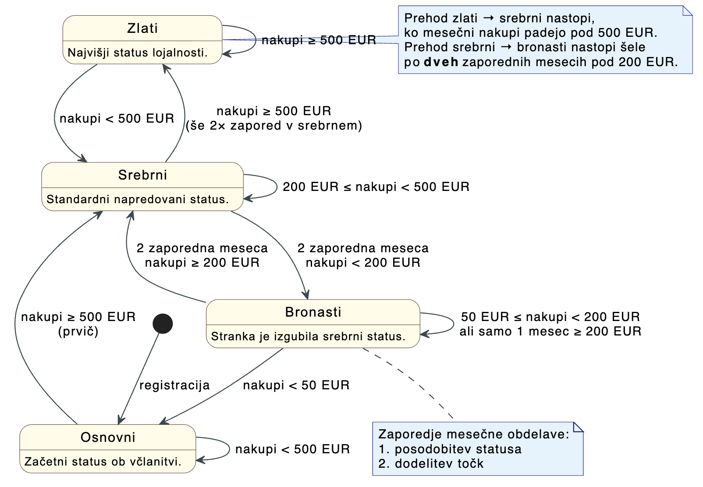
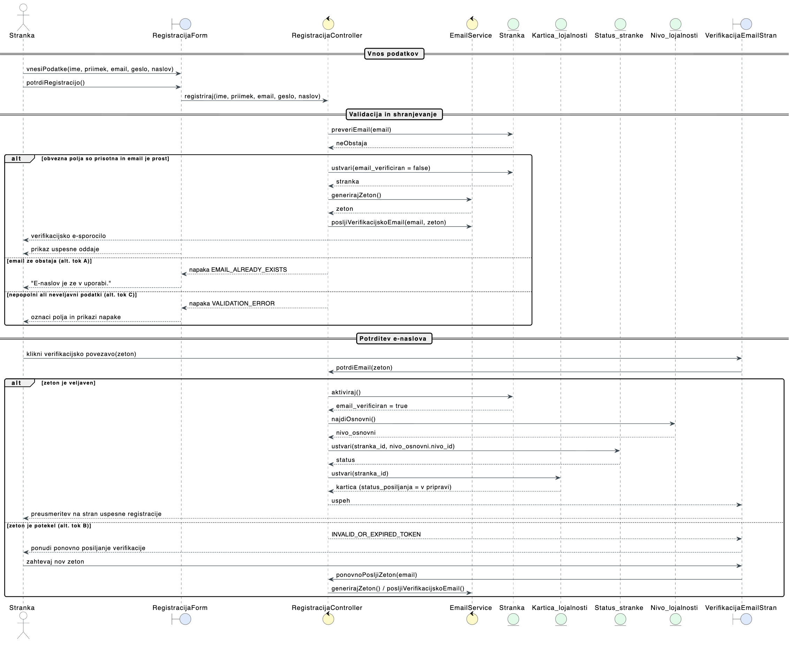
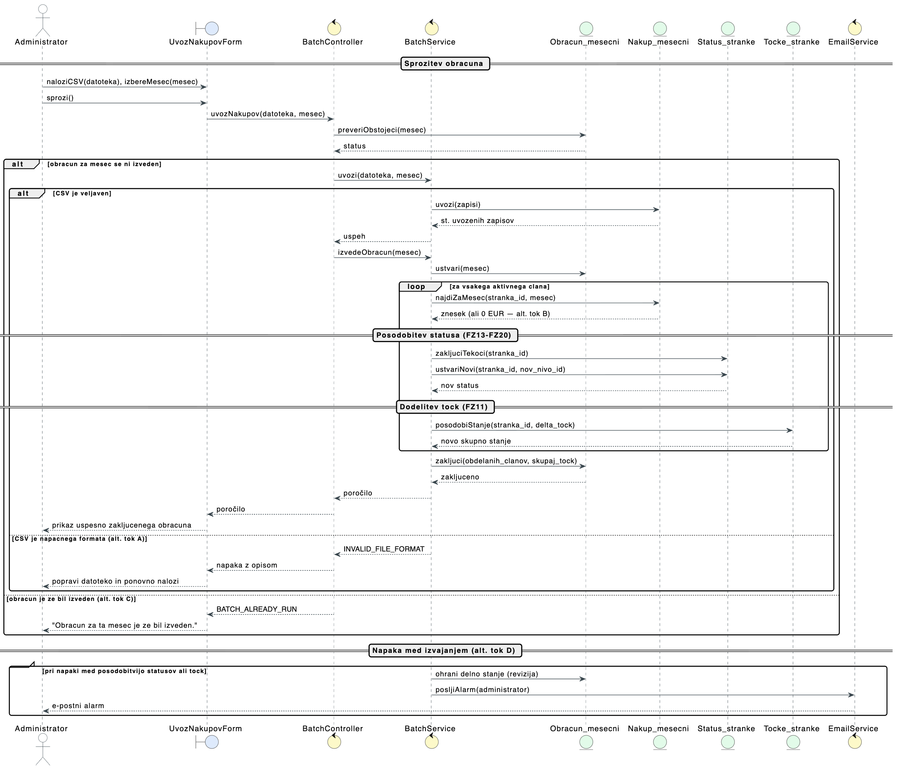

# Analiza in načrtovanje

## 1. Uvod

## 2. Podatkovni model

Podatkovni model je ključni del načrtovanja sistema, saj določa strukturo in organizacijo podatkov, ki jih bo sistem uporabljal. V našem primeru bomo definirali podatkovni model za sistem zvestobe, ki vključuje entitete, njihove atribute in odnose med njimi.

## Diagram entitet in odnosov (ER diagram)

| Oznaka | Tabela             | Opis                                                           |
| ------ | ------------------ | -------------------------------------------------------------- |
| T1     | Stranka            | Entiteta, ki predstavlja člana programa zvestobe.              |
| T2     | Kraj               | Šifrant krajev                                                 |
| T3     | Kartica_lojalnosti | Kartica, ki je vezana na stranko in omogoča zbiranje točk.     |
| T4     | Status_stranke     | Beleži časovne intervale statusa (nivoja) stranke.             |
| T5     | Nivo_lojalnosti    | Šifrant nivojev zvestobe (npr. bronast, srebrn, zlat).         |
| T6     | Tocke_stranke      | Agregiran pregled točk stranke.                                |
| T7     | Transakcija_tock   | Posamezna transakcija dodelitve ali porabe točk.               |
| T8     | Nakup_mesecni      | Mesečni povzetek nakupov stranke, osnova za obračun točk.      |
| T9     | Obracun_mesecni    | Mesečni obračun dodeljenih točk na podlagi nakupov.            |
| T10    | Pravilo_tockovanja | Definira, koliko točk stranka prejme glede na vrednost nakupa. |
| T11    | Pravilo_prehoda    | Pogoji za prehod med nivoji zvestobe.                          |
| T12    | Nagrada            | Katalog nagrad, ki jih stranke lahko unovčijo za točke.        |
| T13    | Unovcitev          | Beleži unovčitev nagrade s strani stranke.                     |

## 3. Funkcionalna razgradnja

Spodaj je predstavljen diagram funkcionalne razgradnje sistema zvestobe, ki prikazuje glavne funkcionalnosti in njihove podfunkcionalnosti. Ta diagram nam pomaga razumeti, kako so različni deli sistema povezani in kako prispevajo k celotni funkcionalnosti programa zvestobe.

## 4. Diagram prehajanja stanj med statusi

## 5. Odločitvena tabela za točkovanje

| Znesek nakupov v mesecu | Osnovni | Bronasti | Srebrni | Zlati |
| ----------------------- | ------: | -------: | ------: | ----: |
| do 200 EUR              |       5 |        0 |     7.5 |    10 |
| med 200 EUR in 1000 EUR |      10 |        5 |      15 |    20 |
| nad 1000 EUR            |      20 |       10 |      30 |    40 |

## 6. Zaslonske maske

### 6.1 Javni del

#### Domača stran

Vstopna stran programa z razlago delovanja, točkovnikom in pregledom nivojev zvestobe. Neregistriran obiskovalec se tu odloči za registracijo ali prijavo.

#### Prijava

Obrazec za prijavo z e-naslovom in geslom.

#### Registracija

Obrazec za ustvaritev novega računa (ime, e-naslov, geslo).

### 6.2 Uporabniški portal

#### Moj portal

Osrednji pogled prijavljenega člana: povzetek statusa in točk, pregled mesečnih nakupov ter razpoložljive nagrade za unovčitev.

#### Točkovnik

Tabela s koeficienti točkovanja po mesečnem razredu nakupa in nivoju zvestobe.

#### Nivoji lojalnosti

Prikaz štirih nivojev programa (Osnovni, Bronasti, Srebrni, Zlati) z opisom pogoja za dosego vsakega.

#### Pravila prehodov

Besedilni seznam pogojev za napredovanje in znižanje med nivoji zvestobe.

### 6.3 Administracija

#### Pregled članov

Tabela vseh registriranih članov s statusom, točkami in zadnjim mesečnim nakupom.

#### Upravljanje nagrad

Seznam razpoložljivih nagrad z opisom in ceno v točkah; vsako nagrado je mogoče urediti.

#### Pravila točkovanja in prehodov

Pregled točkovnika in pravil za prehajanje med nivoji z možnostjo urejanja.

#### Statistika programa

Ključne številke programa: skupno število članov, povprečen mesečni nakup, razporeditev po statusih in skupne točke v obtoku.

### 6.4 Modalni dialogi

#### Uredi točkovnik

Dialog za spremembo koeficientov točkovanja po razredu nakupa in nivoju zvestobe.

#### Uredi pravila prehodov

Dialog za urejanje pogojev prehodov med statusi za vsak možni prehod.

## 7. API načrt

Backend teče na Node.js + Express.js in komunicira z Oracle DB. Vsi zaščiteni endpointi zahtevajo JWT žeton v glavi `Authorization: Bearer <token>`. Odgovori imajo enotno strukturo: polje `success: true/false` in `data` oziroma `error`.

### 7.1 Pregled endpointov

| Metoda | Pot                                        | Dostop | Opis                                        |
| ------ | ------------------------------------------ | ------ | ------------------------------------------- |
| POST   | `/api/auth/register`                       | javno  | Registracija nove stranke                   |
| POST   | `/api/auth/verify-email`                   | javno  | Potrditev e-naslova z žetonom               |
| POST   | `/api/auth/login`                          | javno  | Prijava, vrne JWT                           |
| POST   | `/api/auth/refresh`                        | javno  | Obnova JWT tokena                           |
| GET    | `/api/member/profile`                      | member | Profil in trenutni status člana             |
| GET    | `/api/member/points`                       | member | Skupaj točke in seznam transakcij           |
| GET    | `/api/member/purchases`                    | member | Pregled mesečnih nakupov                    |
| GET    | `/api/member/rewards`                      | member | Katalog nagrad z razpoložljivostjo          |
| POST   | `/api/member/rewards/:nagrada_id/redeem`   | member | Unovčenje nagrade                           |
| GET    | `/api/member/loyalty-card`                 | member | Podatki o kartici lojalnosti                |
| GET    | `/api/admin/members`                       | admin  | Seznam članov s filtri in paginacijo        |
| GET    | `/api/admin/members/:stranka_id`           | admin  | Podrobnosti posameznega člana               |
| GET    | `/api/admin/members/card-export`           | admin  | CSV izvoz podatkov za pošiljanje kartic     |
| GET    | `/api/admin/statistics`                    | admin  | Statistika nakupov in porazdelitev statusov |
| GET    | `/api/admin/rewards`                       | admin  | Seznam vseh nagrad                          |
| POST   | `/api/admin/rewards`                       | admin  | Ustvari novo nagrado                        |
| PUT    | `/api/admin/rewards/:nagrada_id`           | admin  | Uredi obstoječo nagrado                     |
| DELETE | `/api/admin/rewards/:nagrada_id`           | admin  | Deaktiviraj nagrado (soft delete)           |
| GET    | `/api/admin/rules/scoring`                 | admin  | Pregled točkovnika                          |
| PUT    | `/api/admin/rules/scoring/:pravilo_id`     | admin  | Posodobi vrednost točk v točkovniku         |
| GET    | `/api/admin/rules/transitions`             | admin  | Pregled pravil prehodov med statusi         |
| PUT    | `/api/admin/rules/transitions/:pravilo_id` | admin  | Posodobi prag prehoda med statusoma         |
| POST   | `/api/admin/batch/import-purchases`        | admin  | Ročni uvoz mesečnih nakupov iz CSV          |
| POST   | `/api/admin/batch/run-monthly`             | admin  | Ročno sproži mesečni obračun                |
| GET    | `/api/admin/batch/status/:mesec`           | admin  | Stanje in rezultati obračuna za mesec       |

---

### 7.2 Avtentikacija — `/api/auth`

#### `POST /api/auth/register`

Registracija nove stranke. Ustvari račun z začetnim statusom Osnovni in pošlje verifikacijsko e-pošto.

- **Dostop:** javno
- **Telo:** `ime`, `priimek`, `email`, `geslo`, `datum_rojstva`, `ulica`, `postna_stevilka`
- **Odgovor 201:** `stranka_id`, `email`, `status`
- **Napake:** `409 EMAIL_ALREADY_EXISTS`, `400 VALIDATION_ERROR`

#### `POST /api/auth/verify-email`

Potrdi lastništvo e-naslova z žetonom iz verifikacijske e-pošte in aktivira račun.

- **Dostop:** javno
- **Telo:** `token`
- **Odgovor 200:** potrditveno sporočilo
- **Napake:** `400 INVALID_OR_EXPIRED_TOKEN`

#### `POST /api/auth/login`

Prijava stranke ali administratorja. Vrne JWT z vlogo (`member` ali `admin`).

- **Dostop:** javno
- **Telo:** `email`, `geslo`
- **Odgovor 200:** `token`, `role`, `stranka_id`
- **Napake:** `401 INVALID_CREDENTIALS`, `403 EMAIL_NOT_VERIFIED`

#### `POST /api/auth/refresh`

Obnovi obstoječ JWT token pred iztekom veljavnosti.

- **Dostop:** javno
- **Telo:** `token`
- **Odgovor 200:** nov `token`

---

### 7.3 Članski portal — `/api/member`

Vsi endpointi zahtevajo JWT z `role: "member"`.

#### `GET /api/member/profile`

Vrne profil prijavljenega člana z naslovom in trenutnim nivojem zvestobe.

- **Odgovor 200:** `stranka_id`, `ime`, `priimek`, `email`, `datum_rojstva`, `naslov`, `trenutni_status`

#### `GET /api/member/points`

Vrne skupno število točk in paginirano zgodovino transakcij (dodelitve in porabe).

- **Query:** `page`, `pageSize`
- **Odgovor 200:** `skupaj_tock`, `transakcije[]` (`tip`, `tocke`, `datum`, `opis`), `pagination`

#### `GET /api/member/purchases`

Vrne mesečne nakupe člana z zneskom in dodeljenimi točkami za vsak mesec.

- **Query:** `od` (YYYY-MM), `do` (YYYY-MM)
- **Odgovor 200:** seznam z `mesec`, `znesek_nakupov`, `dodeljene_tocke`, `status_ob_obracunu`

#### `GET /api/member/rewards`

Vrne katalog nagrad s podatkom, ali jih član glede na razpoložljive točke lahko unovči.

- **Odgovor 200:** `razpolozljive_tocke`, `nagrade[]` (`nagrada_id`, `naziv`, `opis`, `cena_v_tockah`, `na_voljo`)

#### `POST /api/member/rewards/:nagrada_id/redeem`

Unovči nagrado: odšteje točke in ustvari zapis o unovčitvi.

- **Odgovor 200:** `unovcitev_id`, `nagrada`, `porabljene_tocke`, `preostale_tocke`, `datum`
- **Napake:** `422 INSUFFICIENT_POINTS`, `404 REWARD_NOT_FOUND`, `422 REWARD_NOT_AVAILABLE`

#### `GET /api/member/loyalty-card`

Vrne podatke o kartici lojalnosti člana vključno s statusom pošiljanja.

- **Odgovor 200:** `kartica_id`, `stevilka_kartice`, `datum_izdaje`, `status_posiljanja`

---

### 7.4 Administracija — člani — `/api/admin/members`

Vsi endpointi zahtevajo JWT z `role: "admin"`.

#### `GET /api/admin/members`

Vrne paginirani seznam članov z možnostjo filtriranja po statusu, imenu/e-naslovu in obdobju.

- **Query:** `status`, `od`, `do`, `q` (iskanje), `page`, `pageSize`
- **Odgovor 200:** seznam z `stranka_id`, `ime`, `priimek`, `email`, `trenutni_status`, `skupaj_tock`; `pagination`

#### `GET /api/admin/members/:stranka_id`

Vrne podrobnosti posameznega člana z zgodovino statusov.

- **Odgovor 200:** polni profil + `kartica`, `skupaj_tock`, `zgodovina_statusov[]`
- **Napake:** `404 MEMBER_NOT_FOUND`

#### `GET /api/admin/members/card-export`

Izvozi podatke za pošiljanje kartic lojalnosti v formatu CSV.

- **Query:** `status` (npr. `neposljana`)
- **Odgovor 200:** `text/csv` z vrsticami `stranka_id`, `ime`, `priimek`, `ulica`, `postna_stevilka`, `kraj`, `stevilka_kartice`

---

### 7.5 Administracija — statistika — `/api/admin/statistics`

#### `GET /api/admin/statistics`

Vrne agregirano statistiko programa za izbrano obdobje.

- **Query:** `od` (YYYY-MM), `do` (YYYY-MM)
- **Odgovor 200:** `skupaj_clanov`, `porazdelitev_statusov`, `skupaj_nakupov_eur`, `skupaj_dodeljenih_tock`, `mesecni_pregled[]`

---

### 7.6 Administracija — nagrade — `/api/admin/rewards`

#### `GET /api/admin/rewards`

Vrne seznam vseh nagrad (aktivnih in deaktiviranih).

- **Odgovor 200:** seznam z `nagrada_id`, `naziv`, `opis`, `cena_v_tockah`, `aktivna`

#### `POST /api/admin/rewards`

Ustvari novo nagrado.

- **Telo:** `naziv`, `opis`, `cena_v_tockah`, `aktivna`
- **Odgovor 201:** ustvarjeni zapis nagrade
- **Napake:** `400 VALIDATION_ERROR`

#### `PUT /api/admin/rewards/:nagrada_id`

Uredi obstoječo nagrado (enako telo kot POST).

- **Odgovor 200:** posodobljeni zapis
- **Napake:** `404 REWARD_NOT_FOUND`

#### `DELETE /api/admin/rewards/:nagrada_id`

Deaktivira nagrado (soft delete — nastavi `aktivna = false`).

- **Odgovor 200:** potrditveno sporočilo

---

### 7.7 Administracija — pravila — `/api/admin/rules`

#### `GET /api/admin/rules/scoring`

Vrne celoten točkovnik: za vsak nivo in razred nakupa število dodeljenih točk.

- **Odgovor 200:** seznam z `pravilo_id`, `nivo`, `znesek_od`, `znesek_do`, `tocke`

#### `PUT /api/admin/rules/scoring/:pravilo_id`

Posodobi vrednost točk za posamezno pravilo točkovnika.

- **Telo:** `tocke`
- **Odgovor 200:** posodobljeni zapis
- **Napake:** `404 RULE_NOT_FOUND`

#### `GET /api/admin/rules/transitions`

Vrne pravila za prehajanje med statusi (pogoji napredovanj in znižanj).

- **Odgovor 200:** seznam z `pravilo_id`, `iz_nivoja`, `v_nivo`, `pogoj_tip`, `prag_eur`

#### `PUT /api/admin/rules/transitions/:pravilo_id`

Posodobi finančni prag za prehod med statusoma.

- **Telo:** `prag_eur`
- **Odgovor 200:** posodobljeni zapis
- **Napake:** `404 RULE_NOT_FOUND`

---

### 7.8 Administracija — mesečni obračun — `/api/admin/batch`

#### `POST /api/admin/batch/import-purchases`

Ročni uvoz mesečnih nakupov iz CSV izvoza poslovnega IS. Pred vpisom validira vsako vrstico.

- **Zahteva:** `multipart/form-data` s poljem `file` (CSV) in `mesec` (YYYY-MM)
- **CSV oblika:** stolpca `stranka_id`, `znesek_nakupov`
- **Odgovor 200:** `mesec`, `uvozenih_zapisov`, `napake[]`
- **Napake:** `400 INVALID_FILE_FORMAT`, `409 PURCHASES_ALREADY_IMPORTED`

#### `POST /api/admin/batch/run-monthly`

Ročno sproži mesečni obračun za izbrani mesec. Posodobi statuse, dodeli točke in zapiše rezultate. Cron job (vsak 1. v mesecu ob 02:00) kliče isto logiko avtomatsko.

- **Telo:** `mesec` (YYYY-MM)
- **Odgovor 200:** `obdelanih_clanov`, `sprememb_statusov`, `skupaj_dodeljenih_tock`, `trajanje_ms`
- **Napake:** `409 BATCH_ALREADY_RUN`, `422 PURCHASES_NOT_IMPORTED`

#### `GET /api/admin/batch/status/:mesec`

Vrne stanje in rezultate obračuna za podan mesec (format `YYYY-MM`).

- **Odgovor 200:** `uvoz_nakupov`, `obracun_statusov`, `obracun_tock`, `datum_obracuna`, `obdelanih_clanov`, `skupaj_dodeljenih_tock`

---

## 8. Realizacija primerov uporabe

V tem poglavju sta z razrednim diagramom in diagramom zaporedja realizirana dva ključna primera uporabe iz [01-specifikacija-zahtev.md](01-specifikacija-zahtev.md): **Registracija uporabnika** in **Pripis točk (Mesečni obračun)**. Diagrami sledijo trinivojski razgradnji **boundary–control–entity**: razredi tipa _boundary_ (modra) predstavljajo vmesnike (zaslonske maske, e-poštni sprejem), _control_ (rumena) usklajujejo poslovno logiko, _entity_ (zelena) pa predstavljajo perzistentne tabele iz podatkovnega modela.

### 8.1 Registracija uporabnika

#### Razredni diagram

Razredni diagram prikazuje sodelujoče razrede pri registraciji nove stranke: vnos podatkov in potrditev e-naslova (`RegistracijaForm`, `VerifikacijaEmailStran`), nadzor poteka (`RegistracijaController`, `EmailService`) ter perzistentne entitete (`Stranka`, `Kartica_lojalnosti`, `Status_stranke`, `Nivo_lojalnosti`).

Definicija v PlantUML obliki: [shared/class-diagram-registracija.puml](shared/class-diagram-registracija.puml).

#### Diagram zaporedja

Diagram zaporedja prikazuje dvostopenjski potek registracije: (1) oddaja registracijskega obrazca z validacijo edinstvenosti e-naslova in pošiljanjem verifikacijskega žetona, (2) potrditev e-naslova prek povezave v sporočilu, kar sproži aktivacijo računa, dodelitev začetnega statusa »osnovni« in ustvaritev kartice lojalnosti. Vključeni so alternativni tokovi A (e-naslov že obstaja), B (potečen žeton) in C (neveljavni podatki).

Definicija v PlantUML obliki: [shared/sequence-diagram-registracija.puml](shared/sequence-diagram-registracija.puml).

### 8.2 Pripis točk — Mesečni obračun

#### Razredni diagram

Razredni diagram prikazuje sodelujoče razrede pri mesečnem obračunu: administratorske vmesnike (`UvozNakupovForm`, `BatchStatusPogled`), kontroler in storitveni razred za logiko obračuna (`BatchController`, `BatchService`) ter entitete, ki hranijo uvožene nakupe, status članov in agregirano stanje točk (`Nakup_mesecni`, `Obracun_mesecni`, `Status_stranke`, `Tocke_stranke`).

Definicija v PlantUML obliki: [shared/class-diagram-mesecni-obracun.puml](shared/class-diagram-mesecni-obracun.puml).

#### Diagram zaporedja

Diagram zaporedja prikazuje potek mesečnega obračuna: administrator naloži CSV z mesečnimi nakupi, sistem preveri, da obračun za izbrani mesec še ni bil izveden, uvozi zapise v `Nakup_mesecni` in v zanki za vsakega aktivnega člana posodobi status lojalnosti (FZ13–FZ20) ter dodeli točke po točkovniku (FZ11). Po zaključku zanke sistem zapre zapis v `Obracun_mesecni` in administratorju prikaže poročilo. Vključeni so alternativni tokovi A (napačen CSV format), B (član brez nakupov), C (obračun že izveden) in D (napaka med izvajanjem z alarmom).

Definicija v PlantUML obliki: [shared/sequence-diagram-mesecni-obracun.puml](shared/sequence-diagram-mesecni-obracun.puml).
