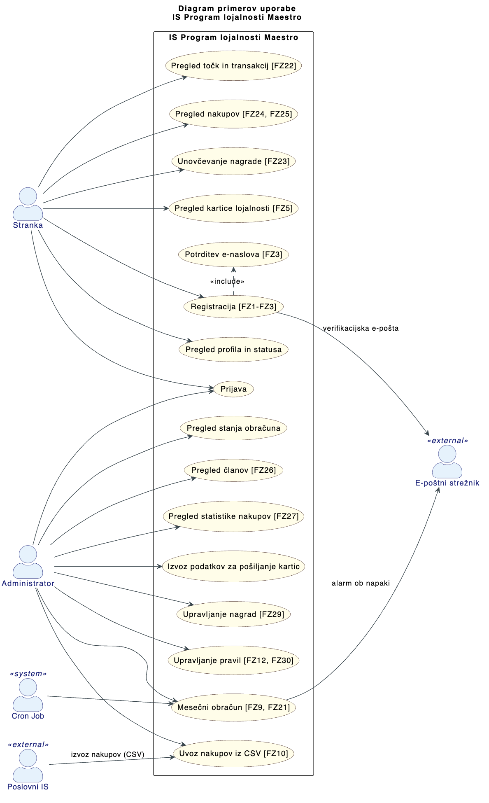
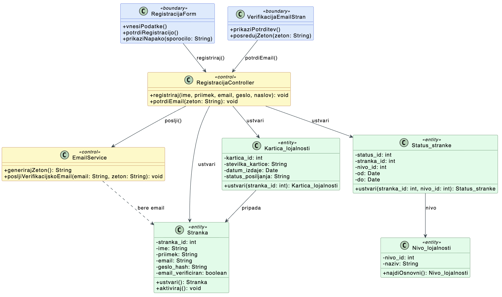
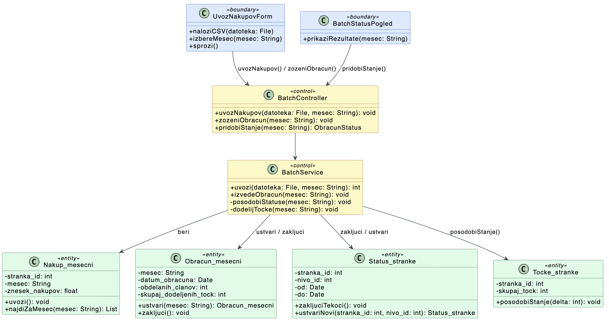
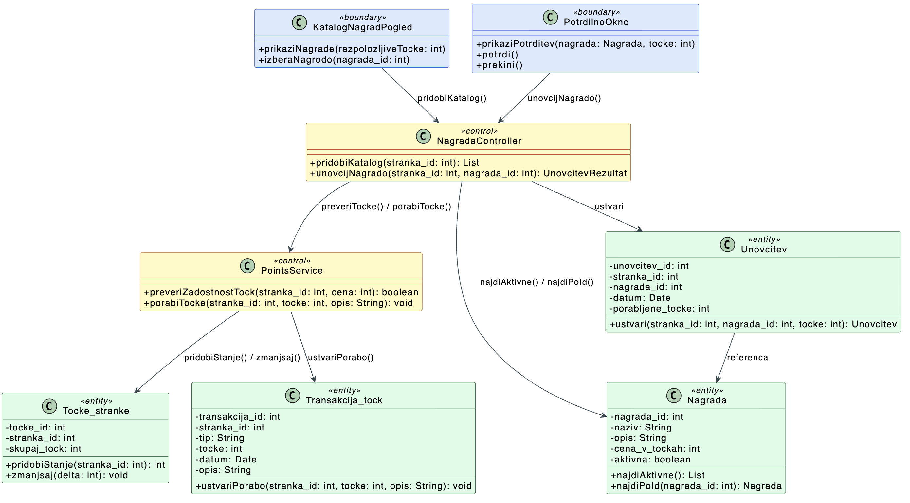

# Izvedbeni načrt

## 1. Okvirni projektni plan — IS Program lojalnosti Maestro

### 1.1 Parametri projekta

| Parameter        | Vrednost                             |
| ---------------- | ------------------------------------ |
| Trajanje         | 12 mesecev (april 2026 – marec 2027) |
| Ekipa            | 5 razvijalcev                        |
| Metodologija     | Scrum, sprinti po 2 tedna            |
| Število sprintov | 26                                   |
| Število izdaj    | 5                                    |
| Ritem izdaj      | Vsake ~2,5 meseca                    |

---

### 1.2 Sestava ekipe

| Vloga                | Število | Odgovornosti                                      |
| -------------------- | ------- | ------------------------------------------------- |
| Tech lead / arhitekt | 1       | Arhitektura, code review, DevOps, CI/CD           |
| Backend razvijalec   | 2       | Node.js/Express API, Oracle DB, batch processing  |
| Frontend razvijalec  | 2       | Članski portal, administratorski portal (SLO/ANG) |

---

### 1.3 Pregled izdaj

| Izdaja | Obdobje                  | Sprinti | Fokus                                         |
| ------ | ------------------------ | ------- | --------------------------------------------- |
| R1     | april – junij 2026       | 1–6     | Temelji: infrastruktura, avtentikacija, baza  |
| R2     | julij – september 2026   | 7–12    | Mesečni obračun: uvoz nakupov, statusi, točke |
| R3     | september – oktober 2026 | 13–16   | Admin panel: člani, statistika, nagrade       |
| R4     | november – december 2026 | 17–22   | Pravila, unovčevanje nagrad, izvoz kartic     |
| R5     | januar – marec 2027      | 23–26   | Lokalizacija, zmogljivost, varnost, poliranje |

---

### 1.4 Podrobnosti po izdajah

---

#### R1 — Temelji sistema (sprinti 1–6, april–junij 2026)

**Cilj:** Delujoča infrastruktura, podatkovna baza in registracija/prijava člana.

##### Sprint 1–2: Infrastruktura in podatkovna baza

- Vzpostavitev repozitorija, CI/CD pipeline, okolja (dev / staging / prod)
- Kreacija Oracle DB shem: T1 Stranka, T2 Kraj, T3 Kartica_lojalnosti, T4 Status_stranke, T5 Nivo_lojalnosti
- Node.js/Express projekt: osnovna struktura, `oracledb` connection pool, `.env` konfiguracija
- Seeder: začetni šifranti (T2 kraji, T5 nivoji lojalnosti)

##### Sprint 3–4: Registracija in e-poštna verifikacija

- `POST /api/auth/register` — vnos osebnih podatkov, kreacija T1, T3, T4 z nivojem `osnovni`
- E-poštna verifikacija: generiranje žetona, pošiljanje prek SMTP (`nodemailer`), `POST /api/auth/verify-email`
- `POST /api/auth/login` — bcrypt, JWT z vlogo
- `POST /api/auth/refresh`
- Middleware: `auth.js`, `requireRole.js`, `validate.js`, `errorHandler.js`

##### Sprint 5–6: Članski portal — osnove (frontend)

- Zaslonske maske: registracija (ZM1), prijava, moj-portal (ZM3)
- `GET /api/member/profile` — prikaz profila in trenutnega statusa
- `GET /api/member/points` — prikaz skupnih točk (transakcije bodo prazne do R2)
- `GET /api/member/loyalty-card` — prikaz podatkov o kartici

**Merilo uspešnosti R1:** Stranka se registrira, potrdi e-naslov, prijavi in vidi profil s statusom `osnovni`.

---

#### R2 — Mesečni obračun točk in statusov (sprinti 7–12, julij–september 2026)

**Cilj:** Delujoč mesečni obračun — uvoz nakupov, izračun statusov in dodelitev točk.

**Merilo uspešnosti R2:** Administrator uvozi CSV, sproži obračun, sistem pravilno posodobi statuse in dodeli točke.

---

#### R3 — Administratorski panel (sprinti 13–16, september–oktober 2026)

**Cilj:** Administrator ima pregled nad člani, statistikami in nagradami.

**Merilo uspešnosti R3:** Administrator vidi člane s filtri, statistike in upravlja katalog nagrad.

---

#### R4 — Pravila, unovčevanje nagrad, izvoz kartic (sprinti 17–22, november–december 2026)

**Cilj:** Konfigurabilnost sistema in unovčevanje nagrad za člane.

**Merilo uspešnosti R4:** Član unovči nagrado; administrator nastavi nova pravila točkovnika in pragove prehodov.

---

#### R5 — Lokalizacija, zmogljivost in zaključek (sprinti 23–26, januar–marec 2027)

**Cilj:** Produkcijsko pripravljen sistem z lokalizacijo in potrjeno zmogljivostjo.

**Merilo uspešnosti R5:** Sistem uspešno opravi mesečni obračun za 500.000 članov, oba portala delujeta v dveh jezikih, produkcijsko okolje je pripravljeno.

---

### 1.5 Podrobnosti prvih sprintov

#### Sprint 1 (teden 1–2): Infrastruktura

| Naloga                                               | Kdo        |
| ---------------------------------------------------- | ---------- |
| Repozitorij, branching strategija (main/dev/feature) | Tech lead  |
| CI/CD pipeline (build, lint, test)                   | Tech lead  |
| Oracle DB: kreacija shem T1, T2, T3, T4, T5          | Backend 1  |
| Node.js/Express boilerplate, `oracledb` pool         | Backend 2  |
| Seeder: T2 (kraji), T5 (nivoji lojalnosti)           | Backend 1  |
| Osnova frontend projekta, router, layout             | Frontend 1 |
| Zaslonska maska: landing page in navigacija          | Frontend 2 |

#### Sprint 2 (teden 3–4): Avtentikacija backend

| Naloga                                                    | Kdo        |
| --------------------------------------------------------- | ---------- |
| `POST /api/auth/register` — validacija, vpis T1 + T3 + T4 | Backend 1  |
| E-poštni servis (`nodemailer`), generiranje žetona        | Backend 2  |
| `POST /api/auth/verify-email`                             | Backend 2  |
| `POST /api/auth/login` — bcrypt, JWT generiranje          | Backend 1  |
| `POST /api/auth/refresh`                                  | Backend 1  |
| Middleware: `auth.js`, `requireRole.js`, `errorHandler`   | Tech lead  |
| Zaslonska maska: registracija (ZM1) — osnova              | Frontend 1 |
| Zaslonska maska: prijava — osnova                         | Frontend 2 |

#### Sprint 3 (teden 5–6): Integracija registracije in profil

| Naloga                                                       | Kdo        |
| ------------------------------------------------------------ | ---------- |
| Integracija registracijske forme z `POST /api/auth/register` | Frontend 1 |
| Potek e-poštne verifikacije na frontendu                     | Frontend 1 |
| Prijavni obrazec, shranjevanje JWT, redirect po vlogi        | Frontend 2 |
| `GET /api/member/profile` — endpoint in controller           | Backend 1  |
| `GET /api/member/loyalty-card`                               | Backend 2  |
| Zaslonska maska: moj-portal (ZM3) — profil in status         | Frontend 2 |
| Unit testi: authService, middleware                          | Tech lead  |

---

## 2. Backend API — IS Program lojalnosti Maestro

### 2.1 Tehnološki sklad

| Komponenta        | Tehnologija                   |
| ----------------- | ----------------------------- |
| Runtime           | Node.js                       |
| Framework         | Express.js                    |
| Podatkovna baza   | Oracle DB (direktna povezava) |
| Oracle driver     | `oracledb` (node-oracledb)    |
| Avtentikacija     | JWT (JSON Web Token)          |
| Zaščita gesel     | `bcrypt`                      |
| Validacija vhodov | `express-validator`           |
| Cron job          | `node-cron`                   |
| E-pošta           | `nodemailer` (SMTP)           |
| CSV uvoz          | `csv-parser`                  |
| Okolje            | `dotenv`                      |

---

### 2.2 Struktura projekta

```
/src
  /config
    db.js              # Oracle DB connection pool
    env.js             # environment variables
  /middleware
    auth.js            # JWT verificacija, pridobitev vloge
    requireRole.js     # ['member'] ali ['admin'] guard
    validate.js        # express-validator error handler
  /routes
    auth.js
    member.js
    admin/
      members.js
      rewards.js
      rules.js
      batch.js
      statistics.js
  /controllers
    authController.js
    memberController.js
    admin/
      membersController.js
      rewardsController.js
      rulesController.js
      batchController.js
      statisticsController.js
  /services
    authService.js
    pointsService.js       # logika dodeljevanja točk
    statusService.js       # logika prehodov med statusi
    batchService.js        # mesečni obračun
    emailService.js
  /jobs
    monthlyBatch.js        # cron job definicija
  /utils
    errors.js              # standardni error razredi
  app.js
  server.js
```

---

### 2.3 Avtentikacija in avtorizacija

#### JWT token

Ob prijavi server vrne JWT token s payload:

```json
{
  "sub": "<stranka_id>",
  "role": "member" | "admin",
  "iat": 1713000000,
  "exp": 1713086400
}
```

Token se pošlje v glavi vsakega zaščitenega zahtevka:

```
Authorization: Bearer <token>
```

#### Vloge

| Vloga    | Dostop          |
| -------- | --------------- |
| `member` | `/api/member/*` |
| `admin`  | `/api/admin/*`  |

---

### 2.4 Splošni format odgovorov

#### Uspeh

```json
{
  "success": true,
  "data": { ... }
}
```

#### Seznam z ostranitvijo (paginacija)

```json
{
  "success": true,
  "data": [ ... ],
  "pagination": {
    "page": 1,
    "pageSize": 20,
    "total": 150
  }
}
```

#### Napaka

```json
{
  "success": false,
  "error": {
    "code": "INVALID_TOKEN",
    "message": "JWT token je neveljaven ali je potekel."
  }
}
```

#### Standardne HTTP kode

| Koda | Pomen                                  |
| ---- | -------------------------------------- |
| 200  | OK                                     |
| 201  | Ustvarjeno                             |
| 400  | Napačna zahteva (validacija)           |
| 401  | Manjka ali neveljaven token            |
| 403  | Nezadostne pravice                     |
| 404  | Vir ne obstaja                         |
| 409  | Konflikt (npr. e-naslov že obstaja)    |
| 422  | Neobdelavna entiteta (poslovna logika) |
| 500  | Interna napaka strežnika               |

---

### 2.5 Pregled vseh endpointov

| Metoda | Pot                                        | Dostop | Opis                                        |
| ------ | ------------------------------------------ | ------ | ------------------------------------------- |
| POST   | `/api/auth/register`                       | javno  | Registracija nove stranke                   |
| POST   | `/api/auth/verify-email`                   | javno  | Potrditev e-naslova z žetonom               |
| POST   | `/api/auth/login`                          | javno  | Prijava, vrne JWT                           |
| POST   | `/api/auth/refresh`                        | javno  | Obnova JWT tokena                           |
| GET    | `/api/member/profile`                      | member | Profil in trenutni status člana             |
| GET    | `/api/member/points`                       | member | Skupaj točke in seznam transakcij           |
| GET    | `/api/member/purchases`                    | member | Pregled mesečnih nakupov                    |
| GET    | `/api/member/rewards`                      | member | Katalog nagrad z razpoložljivostjo          |
| POST   | `/api/member/rewards/:nagrada_id/redeem`   | member | Unovčenje nagrade                           |
| GET    | `/api/member/loyalty-card`                 | member | Podatki o kartici lojalnosti                |
| GET    | `/api/admin/members`                       | admin  | Seznam članov s filtri in paginacijo        |
| GET    | `/api/admin/members/:stranka_id`           | admin  | Podrobnosti posameznega člana               |
| GET    | `/api/admin/members/card-export`           | admin  | CSV izvoz podatkov za pošiljanje kartic     |
| GET    | `/api/admin/statistics`                    | admin  | Statistika nakupov in porazdelitev statusov |
| GET    | `/api/admin/rewards`                       | admin  | Seznam vseh nagrad                          |
| POST   | `/api/admin/rewards`                       | admin  | Ustvari novo nagrado                        |
| PUT    | `/api/admin/rewards/:nagrada_id`           | admin  | Uredi obstoječo nagrado                     |
| DELETE | `/api/admin/rewards/:nagrada_id`           | admin  | Deaktiviraj nagrado (soft delete)           |
| GET    | `/api/admin/rules/scoring`                 | admin  | Pregled točkovnika                          |
| PUT    | `/api/admin/rules/scoring/:pravilo_id`     | admin  | Posodobi vrednost točk v točkovniku         |
| GET    | `/api/admin/rules/transitions`             | admin  | Pregled pravil prehodov med statusi         |
| PUT    | `/api/admin/rules/transitions/:pravilo_id` | admin  | Posodobi prag prehoda med statusoma         |
| POST   | `/api/admin/batch/import-purchases`        | admin  | Ročni uvoz mesečnih nakupov iz CSV          |
| POST   | `/api/admin/batch/run-monthly`             | admin  | Ročno sproži mesečni obračun                |
| GET    | `/api/admin/batch/status/:mesec`           | admin  | Stanje in rezultati obračuna za mesec       |

---

### 2.6 Endpointi

#### 2.6.1 Avtentikacija — `/api/auth`

##### `POST /api/auth/register`

Registracija nove stranke. Ustvari zapis v T1 (Stranka), T3 (Kartica_lojalnosti), T4 (Status_stranke) z začetnim nivojem `osnovni` (T5). Pošlje verifikacijsko e-pošto.

**Request body:**

```json
{
  "ime": "Ana",
  "priimek": "Novak",
  "email": "ana.novak@email.si",
  "geslo": "Geslo123!",
  "datum_rojstva": "1990-05-14",
  "ulica": "Slovenska cesta 1",
  "postna_stevilka": "1000"
}
```

**Response `201`:**

```json
{
  "success": true,
  "data": {
    "stranka_id": 42,
    "email": "ana.novak@email.si",
    "status": "EMAIL_VERIFICATION_PENDING"
  }
}
```

**Napake:** `409 EMAIL_ALREADY_EXISTS`, `400 VALIDATION_ERROR`

---

##### `POST /api/auth/verify-email`

Potrdi lastništvo e-naslova z žetonom iz e-pošte. Aktivira račun.

**Request body:**

```json
{
  "token": "eyJhbGciOiJIUzI1NiJ9..."
}
```

**Response `200`:**

```json
{
  "success": true,
  "data": { "message": "E-naslov uspešno potrjen." }
}
```

**Napake:** `400 INVALID_OR_EXPIRED_TOKEN`

---

##### `POST /api/auth/login`

Prijava stranke ali administratorja. Vrne JWT.

**Request body:**

```json
{
  "email": "ana.novak@email.si",
  "geslo": "Geslo123!"
}
```

**Response `200`:**

```json
{
  "success": true,
  "data": {
    "token": "<jwt>",
    "role": "member",
    "stranka_id": 42
  }
}
```

**Napake:** `401 INVALID_CREDENTIALS`, `403 EMAIL_NOT_VERIFIED`

---

##### `POST /api/auth/refresh`

Obnovi JWT token.

**Request body:**

```json
{
  "token": "<obstoječ jwt>"
}
```

**Response `200`:** nov `token`.

---

#### 2.6.2 Članski portal — `/api/member`

Vsi endpointи zahtevajo JWT z `role: "member"`.

---

##### `GET /api/member/profile`

Profil prijavljenega člana s trenutnim statusom.

**Response `200`:**

```json
{
  "success": true,
  "data": {
    "stranka_id": 42,
    "ime": "Ana",
    "priimek": "Novak",
    "email": "ana.novak@email.si",
    "datum_rojstva": "1990-05-14",
    "naslov": {
      "ulica": "Slovenska cesta 1",
      "postna_stevilka": "1000",
      "kraj": "Ljubljana"
    },
    "trenutni_status": {
      "nivo": "srebrni",
      "od": "2026-02-01"
    }
  }
}
```

---

##### `GET /api/member/points`

Skupaj točke in seznam transakcij (dodelitev + poraba).

**Query params:** `?page=1&pageSize=20`

**Response `200`:**

```json
{
  "success": true,
  "data": {
    "skupaj_tock": 1250,
    "transakcije": [
      {
        "transakcija_id": 301,
        "tip": "DODELITEV",
        "tocke": 150,
        "datum": "2026-03-01",
        "opis": "Mesečni obračun 02/2026"
      },
      {
        "transakcija_id": 298,
        "tip": "PORABA",
        "tocke": -200,
        "datum": "2026-02-15",
        "opis": "Unovčenje: Bon 10 EUR"
      }
    ]
  },
  "pagination": { "page": 1, "pageSize": 20, "total": 8 }
}
```

---

##### `GET /api/member/purchases`

Pregled mesečnih nakupov in izračunanih točk po mesecih.

**Query params:** `?od=2025-01&do=2026-03`

**Response `200`:**

```json
{
  "success": true,
  "data": [
    {
      "mesec": "2026-02",
      "znesek_nakupov": 650.0,
      "dodeljene_tocke": 130,
      "status_ob_obracunu": "srebrni"
    }
  ]
}
```

---

##### `GET /api/member/rewards`

Katalog nagrad, ki jih član lahko unovči glede na razpoložljive točke.

**Response `200`:**

```json
{
  "success": true,
  "data": {
    "razpolozljive_tocke": 1250,
    "nagrade": [
      {
        "nagrada_id": 5,
        "naziv": "Bon 10 EUR",
        "opis": "Popust 10 EUR ob naslednjem nakupu.",
        "cena_v_tockah": 200,
        "na_voljo": true
      },
      {
        "nagrada_id": 6,
        "naziv": "Brezplačna dostava",
        "opis": "Brezplačna dostava pri spletnem nakupu.",
        "cena_v_tockah": 500,
        "na_voljo": false
      }
    ]
  }
}
```

---

##### `POST /api/member/rewards/:nagrada_id/redeem`

Unovčenje nagrade. Zmanjša `skupaj_tock` v T6 in ustvari transakcijo v T7 ter zapis v T13.

**Response `200`:**

```json
{
  "success": true,
  "data": {
    "unovcitev_id": 88,
    "nagrada": "Bon 10 EUR",
    "porabljene_tocke": 200,
    "preostale_tocke": 1050,
    "datum": "2026-04-15"
  }
}
```

**Napake:** `422 INSUFFICIENT_POINTS`, `404 REWARD_NOT_FOUND`, `422 REWARD_NOT_AVAILABLE`

---

##### `GET /api/member/loyalty-card`

Podatki o kartici lojalnosti člana.

**Response `200`:**

```json
{
  "success": true,
  "data": {
    "kartica_id": 101,
    "stevilka_kartice": "MC-0000042",
    "datum_izdaje": "2025-01-10",
    "status_posiljanja": "POSLANA"
  }
}
```

---

#### 2.6.3 Administracija — člani — `/api/admin/members`

Vsi endpointи zahtevajo JWT z `role: "admin"`.

---

##### `GET /api/admin/members`

Seznam članov s filtri po statusu, mesecu in imenu/e-naslovu. Podpira paginacijo.

**Query params:** `?status=srebrni&od=2026-01&do=2026-03&q=novak&page=1&pageSize=20`

**Response `200`:**

```json
{
  "success": true,
  "data": [
    {
      "stranka_id": 42,
      "ime": "Ana",
      "priimek": "Novak",
      "email": "ana.novak@email.si",
      "trenutni_status": "srebrni",
      "skupaj_tock": 1250
    }
  ],
  "pagination": { "page": 1, "pageSize": 20, "total": 340 }
}
```

---

##### `GET /api/admin/members/:stranka_id`

Podrobnosti posameznega člana z zgodovino statusov in točk.

**Response `200`:**

```json
{
  "success": true,
  "data": {
    "stranka_id": 42,
    "ime": "Ana",
    "priimek": "Novak",
    "email": "ana.novak@email.si",
    "kartica": { "stevilka_kartice": "MC-0000042" },
    "skupaj_tock": 1250,
    "zgodovina_statusov": [
      { "nivo": "osnovni", "od": "2025-01-10", "do": "2025-09-30" },
      { "nivo": "srebrni", "od": "2026-02-01", "do": null }
    ]
  }
}
```

---

##### `GET /api/admin/members/card-export`

Izvoz podatkov za pošiljanje kartic lojalnosti po navadni pošti (CSV).

**Query params:** `?status=neposljana`

**Response `200`:** `Content-Type: text/csv`

```
stranka_id,ime,priimek,ulica,postna_stevilka,kraj,stevilka_kartice
42,Ana,Novak,Slovenska cesta 1,1000,Ljubljana,MC-0000042
```

---

#### 2.6.4 Administracija — statistika — `/api/admin/statistics`

##### `GET /api/admin/statistics`

Pregled nakupne statistike in porazdelitve statusov za izbrano obdobje.

**Query params:** `?od=2026-01&do=2026-03`

**Response `200`:**

```json
{
  "success": true,
  "data": {
    "obdobje": { "od": "2026-01", "do": "2026-03" },
    "skupaj_clanov": 12400,
    "porazdelitev_statusov": {
      "osnovni": 8100,
      "bronasti": 2000,
      "srebrni": 1800,
      "zlati": 500
    },
    "skupaj_nakupov_eur": 4580000.0,
    "skupaj_dodeljenih_tock": 920000,
    "mesecni_pregled": [
      {
        "mesec": "2026-01",
        "skupaj_nakupov_eur": 1500000.0,
        "skupaj_dodeljenih_tock": 300000,
        "stevilo_aktivnih_clanov": 10200
      }
    ]
  }
}
```

---

#### 2.6.5 Administracija — nagrade — `/api/admin/rewards`

##### `GET /api/admin/rewards`

Seznam vseh nagrad.

**Response `200`:**

```json
{
  "success": true,
  "data": [
    {
      "nagrada_id": 5,
      "naziv": "Bon 10 EUR",
      "opis": "Popust 10 EUR ob naslednjem nakupu.",
      "cena_v_tockah": 200,
      "aktivna": true
    }
  ]
}
```

---

##### `POST /api/admin/rewards`

Ustvari novo nagrado.

**Request body:**

```json
{
  "naziv": "Bon 20 EUR",
  "opis": "Popust 20 EUR ob naslednjem nakupu.",
  "cena_v_tockah": 400,
  "aktivna": true
}
```

**Response `201`:** ustvarjeni zapis nagrade.

**Napake:** `400 VALIDATION_ERROR`

---

##### `PUT /api/admin/rewards/:nagrada_id`

Uredi obstoječo nagrado. Telo zahteva enako kot POST.

**Response `200`:** posodobljeni zapis.

**Napake:** `404 REWARD_NOT_FOUND`

---

##### `DELETE /api/admin/rewards/:nagrada_id`

Deaktivira nagrado (soft delete — nastavi `aktivna = false`).

**Response `200`:**

```json
{ "success": true, "data": { "message": "Nagrada deaktivirana." } }
```

---

#### 2.6.6 Administracija — pravila — `/api/admin/rules`

##### `GET /api/admin/rules/scoring`

Pregled celotnega točkovnika (T10).

**Response `200`:**

```json
{
  "success": true,
  "data": [
    {
      "pravilo_id": 1,
      "nivo": "osnovni",
      "znesek_od": 0,
      "znesek_do": 200,
      "tocke": 5
    },
    {
      "pravilo_id": 2,
      "nivo": "osnovni",
      "znesek_od": 200,
      "znesek_do": 1000,
      "tocke": 10
    },
    {
      "pravilo_id": 3,
      "nivo": "osnovni",
      "znesek_od": 1000,
      "znesek_do": null,
      "tocke": 20
    },
    {
      "pravilo_id": 4,
      "nivo": "bronasti",
      "znesek_od": 0,
      "znesek_do": 200,
      "tocke": 0
    }
  ]
}
```

---

##### `PUT /api/admin/rules/scoring/:pravilo_id`

Posodobi vrednost točk za posamezno pravilo.

**Request body:**

```json
{
  "tocke": 12
}
```

**Response `200`:** posodobljeni zapis.

---

##### `GET /api/admin/rules/transitions`

Pregled pravil prehodov med statusi (T11).

**Response `200`:**

```json
{
  "success": true,
  "data": [
    {
      "pravilo_id": 10,
      "iz_nivoja": "osnovni",
      "v_nivo": "srebrni",
      "pogoj_tip": "PRESEZI_PRAG_1X",
      "prag_eur": 500
    },
    {
      "pravilo_id": 11,
      "iz_nivoja": "srebrni",
      "v_nivo": "zlati",
      "pogoj_tip": "PRESEZI_PRAG_2X_ZAPOREDNO",
      "prag_eur": 500
    }
  ]
}
```

---

##### `PUT /api/admin/rules/transitions/:pravilo_id`

Posodobi prag za prehod med statusoma.

**Request body:**

```json
{
  "prag_eur": 600
}
```

**Response `200`:** posodobljeni zapis.

---

#### 2.6.7 Administracija — mesečni obračun — `/api/admin/batch`

##### `POST /api/admin/batch/import-purchases`

Ročni uvoz mesečnih nakupov iz CSV datoteke (izvoz iz poslovnega IS).

**Request:** `multipart/form-data`

- `file`: CSV datoteka
- `mesec`: `"2026-03"` (format YYYY-MM)

**Pričakovana oblika CSV:**

```
stranka_id,znesek_nakupov
42,650.00
55,120.50
```

**Response `200`:**

```json
{
  "success": true,
  "data": {
    "mesec": "2026-03",
    "uvozenih_zapisov": 12400,
    "napake": []
  }
}
```

**Napake:** `400 INVALID_FILE_FORMAT`, `409 PURCHASES_ALREADY_IMPORTED`

---

##### `POST /api/admin/batch/run-monthly`

Ročno sproži mesečni obračun za izbrani mesec (samo če uvoz že obstaja in obračun še ni bil izveden). Cron job kliče isto logiko avtomatsko.

Zaporedje obdelave (FZ21):

1. Posodobi status vsakega člana glede na T11 in T8.
2. Dodeli točke glede na novi status in T10.
3. Zapiše rezultate v T9, posodobi T6 in T7.

**Request body:**

```json
{
  "mesec": "2026-03"
}
```

**Response `200`:**

```json
{
  "success": true,
  "data": {
    "mesec": "2026-03",
    "obdelanih_clanov": 12400,
    "sprememb_statusov": 312,
    "skupaj_dodeljenih_tock": 298400,
    "trajanje_ms": 4210
  }
}
```

**Napake:** `409 BATCH_ALREADY_RUN`, `422 PURCHASES_NOT_IMPORTED`

---

##### `GET /api/admin/batch/status/:mesec`

Pregled stanja in rezultatov obračuna za mesec (format `YYYY-MM`).

**Response `200`:**

```json
{
  "success": true,
  "data": {
    "mesec": "2026-03",
    "uvoz_nakupov": "IZVEDEN",
    "obracun_statusov": "IZVEDEN",
    "obracun_tock": "IZVEDEN",
    "datum_obracuna": "2026-04-01T02:00:00Z",
    "obdelanih_clanov": 12400,
    "skupaj_dodeljenih_tock": 298400
  }
}
```

---

### 2.7 Cron job — mesečni obračun

Obračun se sproži avtomatsko enkrat mesečno z `node-cron`. Časovni razpored:

```
0 2 1 * *   →  vsak 1. v mesecu ob 02:00
```

Job izvede:

1. Preveri, ali so nakupi za pretekli mesec že uvoženi.
2. Če da, sproži `batchService.runMonthly(pretekliMesec)`.
3. Zapiše rezultat v log in v tabelo T9.
4. Ob napaki zabeleži napako in pošlje opozorilo administratorju na e-pošto.

---

### 2.8 Middleware

| Middleware        | Opis                                                                |
| ----------------- | ------------------------------------------------------------------- |
| `auth.js`         | Verificira JWT, doda `req.user = { id, role }` na zahtevek          |
| `requireRole.js`  | Preveri, ali ima `req.user.role` zahtevan dostop (`member`/`admin`) |
| `validate.js`     | Zbere napake `express-validator` in vrne `400 VALIDATION_ERROR`     |
| `errorHandler.js` | Centralni handler za neobravnavane napake, vrne `500`               |

---

### 2.9 Varnostne opombe

- Gesla se hranijo kot `bcrypt` hash (nikoli v plaintext).
- JWT tajni ključ je v `.env`, ni v kodi.
- Verifikacijski e-poštni žeton ima časovno omejitev (npr. 24 ur).
- Oracle DB queries so parametrizirani (zaščita pred SQL injection).
- CSV uvoz validira vsako vrstico pred vpisom v bazo.
- Rate limiting na `/api/auth/*` endpointih (preprečevanje brute-force).

## 3. Diagram primerov uporabe - V2



### 3.1 Opisi primerov uporabe

#### Stranka

| Primer uporabe                              | Opis                                                                                                                                                                                        |
| ------------------------------------------- | ------------------------------------------------------------------------------------------------------------------------------------------------------------------------------------------- |
| **Registracija [FZ1–FZ3]**                  | Stranka se registrira v program lojalnosti z vnosom osebnih podatkov. Sistem ustvari račun z začetnim statusom `osnovni`, dodeli kartico lojalnosti in sproži postopek potrditve e-naslova. |
| **Potrditev e-naslova [FZ3]** _(«include»)_ | Stranka potrdi lastništvo e-naslova s klikom na verifikacijsko povezavo iz e-pošte. Šele ob uspešni potrditvi se račun aktivira in prijava postane možna.                                   |
| **Prijava**                                 | Stranka ali administrator se prijavi z e-naslovom in geslom. Sistem vrne JWT token, ki se uporablja za dostop do zaščitenih funkcij portala.                                                |
| **Pregled profila in statusa**              | Prijavljena stranka pregleda svoje osebne podatke (ime, naslov, e-naslov) in trenutni statusni nivo lojalnosti ter datum, ko je status začel veljati.                                       |
| **Pregled točk in transakcij [FZ22]**       | Stranka pregleda skupno število zbranih točk in kronološko zgodovino transakcij — dodelitve točk ob mesečnih obračunih in porabe ob unovčevanju nagrad.                                     |
| **Pregled nakupov [FZ24, FZ25]**            | Stranka pregleda mesečne zneske nakupov po posameznih mesecih skupaj s statusom ob obračunu in dodeljenim številom točk za vsak mesec.                                                      |
| **Unovčevanje nagrade [FZ23]**              | Stranka izbere nagrado iz kataloga in jo unovči za zbrane točke. Sistem preveri zadostnost točk, zmanjša stanje in zabeleži unovčitev.                                                      |
| **Pregled kartice lojalnosti [FZ5]**        | Stranka pregleda podatke o svoji kartici lojalnosti: številko kartice, datum izdaje in status pošiljanja po navadni pošti.                                                                  |

#### Administrator

| Primer uporabe                          | Opis                                                                                                                                                                                           |
| --------------------------------------- | ---------------------------------------------------------------------------------------------------------------------------------------------------------------------------------------------- |
| **Uvoz nakupov iz CSV [FZ10]**          | Administrator ročno naloži CSV datoteko z mesečnimi zneski nakupov strank, ki jo pripravi poslovni IS. Sistem validira vsako vrstico in shrani podatke kot osnovo za mesečni obračun.          |
| **Mesečni obračun [FZ9, FZ21]**         | Administrator ali Cron Job sproži mesečni obračun za pretekli mesec. Sistem najprej posodobi statusne nivoje vseh članov glede na pravila prehodov, nato dodeli točke glede na točkovnik.      |
| **Pregled stanja obračuna**             | Administrator pregleda rezultate mesečnega obračuna za izbrani mesec: stanje uvoza nakupov, število posodobitev statusov, skupaj dodeljene točke in čas izvedbe.                               |
| **Pregled članov [FZ26]**               | Administrator pregleda seznam vseh članov programa s filtri po statusu, imenu/e-naslovu in časovnem obdobju. Iz seznama dostopa do podrobnega pregleda posameznega člana z zgodovino statusov. |
| **Pregled statistike nakupov [FZ27]**   | Administrator pregleda agregirano statistiko za izbrano obdobje: porazdelitev članov po statusih, skupni znesek nakupov, skupaj dodeljene točke in mesečni pregled aktivnosti.                 |
| **Izvoz podatkov za pošiljanje kartic** | Administrator izvozi CSV datoteko s poštnimi naslovi članov, ki jim kartice lojalnosti še niso bile poslane, za namen fizičnega pošiljanja po navadni pošti.                                   |
| **Upravljanje nagrad [FZ29]**           | Administrator upravlja katalog nagrad: dodaja nove nagrade z opisom in ceno v točkah, ureja obstoječe ter deaktivira tiste, ki niso več na voljo (soft delete).                                |
| **Upravljanje pravil [FZ12, FZ30]**     | Administrator ureja vrednosti točkovnika (točke glede na zneskovni razred in statusni nivo) ter pragove za prehode med statusnimi nivoji, brez posegov v logiko sistema.                       |

#### Sistemski akterji

| Akter                 | Primer uporabe                | Opis                                                                                                                                                |
| --------------------- | ----------------------------- | --------------------------------------------------------------------------------------------------------------------------------------------------- |
| **Cron Job**          | Mesečni obračun               | Vsak 1. v mesecu ob 02:00 avtomatsko sproži mesečni obračun za pretekli mesec, če so nakupi že uvoženi. Ob napaki pošlje opozorilo administratorju. |
| **Poslovni IS**       | Uvoz nakupov iz CSV           | Zunanja aplikacija trade verige pripravi CSV izvoz mesečnih nakupov po strankah, ki ga administrator prenese in uvozi v sistem.                     |
| **E-poštni strežnik** | Registracija, Mesečni obračun | Posreduje verifikacijsko e-pošto ob registraciji ter alarmno e-pošto administratorju ob morebitni napaki med mesečnim obračunom.                    |

---

## 4. Razredni diagrami (BCE)

Razredni diagrami sledijo vzorcu **Boundary–Control–Entity (BCE)**:

| Tip            | Barva  | Vloga                                                                            |
| -------------- | ------ | -------------------------------------------------------------------------------- |
| `<<boundary>>` | modra  | Vmesniški razredi — zaslonske maske in API-ji, ki komunicirajo z zunanjim svetom |
| `<<control>>`  | rumena | Kontrolni razredi — vsebujejo poslovno logiko in orkestrirajo tok uporabe        |
| `<<entity>>`   | zelena | Entitetni razredi — podatkovni modeli, ki se preslikajo na tabele v bazi         |

### 4.1 Registracija [FZ1–FZ3]



### 4.2 Mesečni obračun [FZ9, FZ21]



### 4.3 Unovčevanje nagrade [FZ23]


